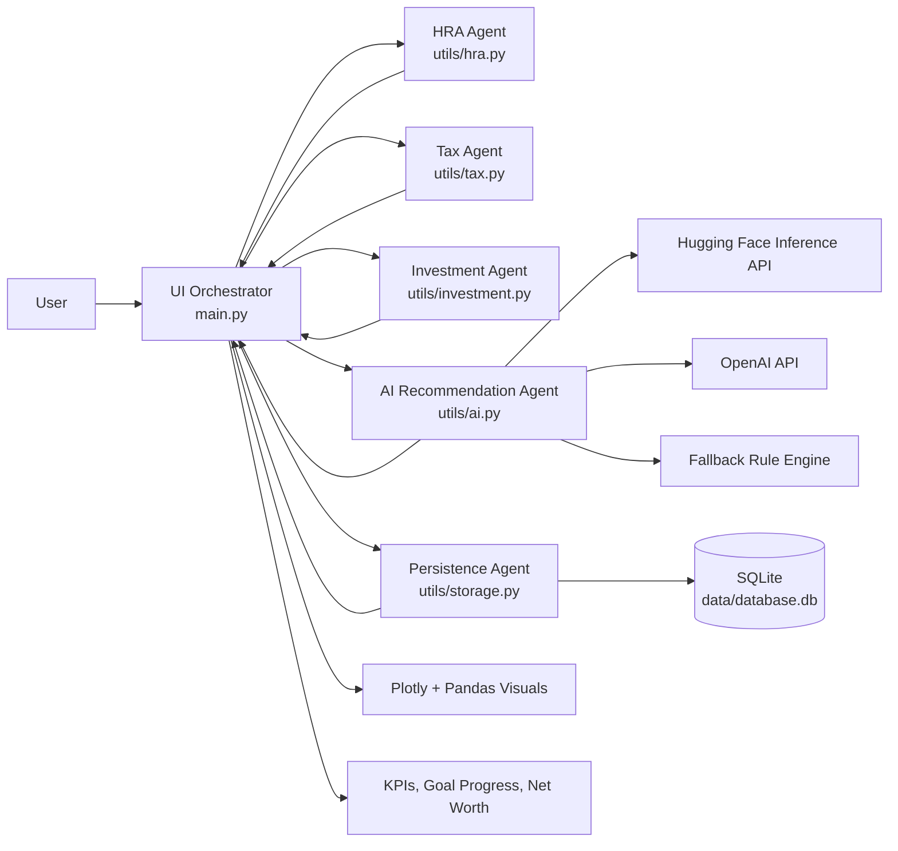

# Couple's Money Planner: Architecture Document

## System Purpose

Couple's Money Planner is a Streamlit-based financial planning system for Indian households. The architecture uses a coordinator-and-specialists pattern: one UI orchestrator coordinates domain-specific agents (tax, HRA, investments, AI, and persistence) and composes outputs into dashboards and recommendations.

## High-Level Architecture Diagram

## Agent Roles

1. UI Orchestrator Agent (main.py)
- Controls user flows: authentication, input forms, tabs, reruns.
- Maintains session state and dispatches data to all domain agents.
- Aggregates domain outputs into KPIs, charts, and recommendation payloads.

2. HRA Agent (utils/hra.py)
- Computes exemption values for each partner.
- Applies metro/non-metro logic.
- Recommends best claimant for optimized household tax outcome.

3. Tax Agent (utils/tax.py)
- Computes old regime vs new regime tax.
- Produces recommendation and potential savings.
- Generates slab-wise breakdown with rebate and cess for transparency.

4. Investment Agent (utils/investment.py)
- Splits SIP by partner income ratio.
- Produces allocation guidance by risk profile.
- Calculates insurance recommendation, savings score, and net worth math utilities.

5. AI Recommendation Agent (utils/ai.py)
- Builds financial context payload.
- Routes model provider based on environment configuration.
- Returns actionable recommendations and enforces fallback for continuity.

6. Persistence Agent (utils/storage.py)
- Handles user auth, password resets, profile snapshots, goal CRUD.
- Initializes and migrates schema safely for backward compatibility.
- Ensures user-scoped reads/writes to prevent data leakage.

## Communication Model

### Request Flow

1. User enters or edits household financial inputs in UI.
2. UI validates values and updates session profile state.
3. UI calls HRA, Tax, and Investment agents with normalized inputs.
4. UI combines outputs into dashboard metrics and visuals.
5. If AI Suggestions is requested, UI sends consolidated payload to AI agent.
6. AI agent returns model output or fallback recommendations.
7. Persistence agent stores/retrieves goals and profile snapshots.

### Data Contracts (Practical)

- Input payload includes partner incomes, expenses, deductions, SIP, dependents, and goals.
- Domain agents return typed dictionaries (tax totals, breakdown rows, SIP splits, insurance values).
- UI is the only integration point exposed to end users; domain agents do not call each other directly.

## Tool Integrations

1. Streamlit
- UI framework, session handling, forms, tabs, and reactive reruns.

2. Pandas and Plotly
- Tabular modeling plus visual analytics (bar, line, area, pie).

3. SQLite via sqlite3
- Local transactional persistence for users, profiles, goals, password reset tokens.

4. OpenAI SDK
- LLM generation path for personalized recommendations.

5. Hugging Face Inference API
- Alternate model provider path, useful for provider resilience or cost controls.

6. dotenv
- Environment configuration for provider strategy and credentials.

## Error-Handling Logic

### AI Provider Resilience

- Configurable routing via AI_PROVIDER environment setting.
- In auto mode: try Hugging Face first, then OpenAI.
- If both fail (API/network/config issues), return deterministic fallback advice.
- Result: AI tab remains functional under external outages.

### Validation and Input Safety

- Numeric fields use non-negative constraints.
- Goal creation blocks invalid planning states (for example, zero monthly contribution with pending target).
- Derived metrics guard against divide-by-zero or missing-value states.

### Persistence and Schema Safety

- init_db creates missing tables and applies compatibility migrations.
- Reset-token flows validate expiry and one-time usage.
- Passwords use PBKDF2-HMAC salted hashes.

### Session and UX Safety

- Missing profile/session keys are auto-initialized.
- Save, reload, and reset actions recalculate derived values to avoid stale dashboards.
- User-facing operations surface clear success/error messages instead of raw exceptions.

## Operational Notes

- Architecture is modular and extension-ready: each domain agent can be upgraded without changing the full UI flow.
- The fallback-first reliability posture is appropriate for hackathon and production pilot deployments.
- For scale-out, the same agent boundaries can map to API services later with minimal redesign.
