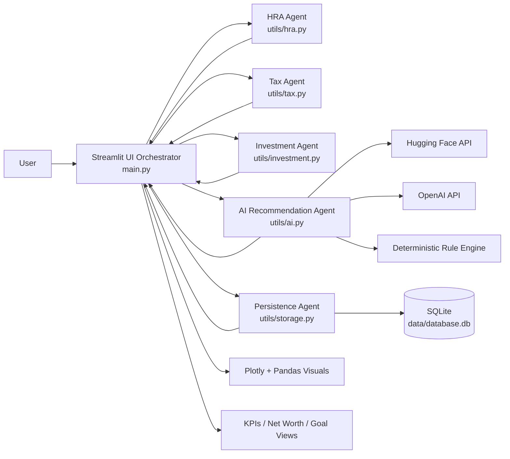

# Couple's Money Planner: Architecture and Impact Model

## 1) Architecture Overview

This application is a Streamlit-based financial planning platform for couples in India. It uses a modular, agent-like design where each domain responsibility is isolated into a focused computation unit and coordinated by the UI orchestration layer.

### 1.1 Agent Roles and Responsibilities

1. UI Orchestrator Agent (`main.py`)
- Owns session state, user flow, tab routing, and cross-module orchestration.
- Collects partner inputs and dispatches to domain agents.
- Aggregates outputs into dashboards, KPIs, charts, and recommendations.

2. Tax Agent (`utils/tax.py`)
- Computes Old vs New regime tax values.
- Applies slab-level logic, rebate handling, cess, and recommendation logic.
- Produces both summary and slab-wise breakdown for explainability.

3. HRA Agent (`utils/hra.py`)
- Calculates HRA exemption with metro/non-metro logic.
- Compares partner claims and returns best claimant recommendation.

4. Investment Agent (`utils/investment.py`)
- Calculates SIP split by partner income ratio.
- Produces allocation guidance by risk profile (ELSS/PPF/NPS/Other).
- Computes insurance recommendation and savings score.
- Computes net worth from assets/liabilities snapshots.

5. AI Recommendation Agent (`utils/ai.py`)
- Builds finance context payload and invokes AI inference.
- Routes provider in order: Hugging Face -> OpenAI -> deterministic fallback (depending on `AI_PROVIDER`).
- Ensures actionable recommendations even under API failure scenarios.

6. Persistence Agent (`utils/storage.py` + SQLite)
- Handles authentication, password reset flow, profile versioning, and goal CRUD.
- Performs schema initialization and backward-compatible migrations.
- Enforces user-scoped access for goals and profiles.

### 1.2 Communication and Data Flow

### 1.3 Runtime Interaction Sequence

1. User authentication is validated through the Persistence Agent.
2. UI Orchestrator loads latest profile snapshot (or default profile) into session.
3. Input updates trigger domain computations:
- HRA exemption and best claimant
- Tax regime comparison and breakdown
- SIP split, insurance suggestions, savings score
- Net worth from assets/liabilities
4. Dashboard composes outputs into visual and numeric views.
5. AI Suggestions tab builds a consolidated payload and calls the AI Recommendation Agent.
6. AI Agent returns either model-generated output or fallback recommendations.
7. Goal updates (add/delete) persist instantly to SQLite and refresh in dashboard.

## 2) Tool Integrations

1. Streamlit
- Form input handling, session state, tabs, metrics, and reruns.

2. Pandas + Plotly
- Data frame preparation and visualization (bar, pie, area, line charts).

3. SQLite (`sqlite3`)
- Lightweight local persistence for users, profiles, goals, reset tokens.

4. OpenAI SDK
- LLM-based recommendation generation when key is configured.

5. Hugging Face Inference API
- Alternate model provider with API-token support.

6. Dotenv
- Environment bootstrap for provider model settings and keys.

## 3) Error-Handling and Resilience Logic

### 3.1 External AI Failure Handling

- Provider routing is defensive by design:
1. If `AI_PROVIDER=auto`, app first attempts Hugging Face.
2. If unavailable or malformed response, it attempts OpenAI.
3. If OpenAI is unavailable (no key, exception, API error), app falls back to deterministic rule engine.

Result: AI section remains functional even when third-party APIs fail.

### 3.2 Data and Validation Safeguards

- Numeric inputs enforce non-negative values (`min_value=0.0`) for finance fields.
- Goal creation blocks invalid states (e.g., monthly contribution = 0 with unmet target).
- Password reset validates token expiry and one-time usage before password update.
- Passwords are hashed using PBKDF2-HMAC with per-password random salt.

### 3.3 Persistence and Compatibility

- Startup `init_db()` performs table creation and backward-compatible migrations.
- Legacy schema support exists for reset token columns.
- User scoping is applied to goal deletion and profile retrieval to prevent cross-user data access.

### 3.4 UI/Session Robustness

- Missing profile/session state is auto-initialized.
- Reset/reload actions recalculate derived asset state to avoid stale metrics.
- Errors in auth/reset flows return user-safe messages instead of hard crashes.

## 4) Impact Model (Quantified)

Below is a back-of-envelope business impact estimate using explicit assumptions.

### 4.1 Assumptions

1. Active couples per month: 1,200
2. Advisor-led baseline planning effort: 90 minutes/couple/month
3. With this app, advisor-assisted effort: 25 minutes/couple/month
4. Advisor blended cost: Rs 800/hour
5. Share of active couples applying recommendations: 35%
6. Average tax + allocation benefit for adopters: Rs 18,000/year per couple
7. Paid users: 1,500, ARPU: Rs 299/month
8. AI fallback reduces avoidable AI-related churn from 5% to 2% annually

### 4.2 Time Saved

Formula:

- Time saved per couple per month = (90 - 25) minutes = 65 minutes
- Total monthly time saved = 1,200 x 65 = 78,000 minutes = 1,300 hours

Estimated impact:

- 1,300 advisor-hours saved per month
- Annualized: 15,600 advisor-hours saved

### 4.3 Cost Reduced

Formula:

- Monthly operations cost reduction = 1,300 hours x Rs 800 = Rs 1,040,000
- Annual operations cost reduction = Rs 1,040,000 x 12 = Rs 12,480,000

Customer-side financial optimization value (not company opex):

- Adopter couples = 1,200 x 35% = 420
- Annual user savings recovered = 420 x Rs 18,000 = Rs 7,560,000

### 4.4 Revenue Recovered

Revenue recovery from reliability (AI fallback + graceful degradation):

- Churn avoided = 1,500 x (5% - 2%) = 45 users
- Recovered MRR = 45 x Rs 299 = Rs 13,455
- Recovered ARR = Rs 13,455 x 12 = Rs 161,460

### 4.5 Summary Table

| Metric | Estimate |
|---|---:|
| Advisor time saved | 1,300 hours/month |
| Internal cost reduced | Rs 1,040,000/month |
| Internal cost reduced (annual) | Rs 12,480,000/year |
| Customer savings enabled | Rs 7,560,000/year |
| Revenue recovered (reliability) | Rs 161,460/year |

## 5) Notes on Confidence and Limits

1. Estimates are directional and intended for planning, not audited reporting.
2. Actual impact depends on user behavior, adherence, and cohort quality.
3. The model can be tightened by replacing assumptions with production analytics:
- Funnel conversion by tab usage
- Recommendation acceptance rates
- Cohort churn by AI provider uptime
- Average handling time before/after app adoption
